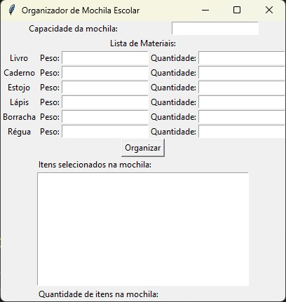
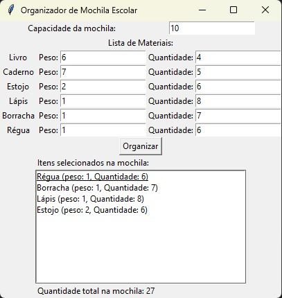

# PD_mochila-Grupo25

**Número da Lista**: 25<br>
**Conteúdo da Disciplina**: Programação Dinâmica

## Alunos
|Matrícula | Aluno |
| -- | -- |
| 19/0036435  |  Pedro Henrique Carvalho Campos  |
| 20/0019520  |  Hian Praxedes de Souza Oliveira |

## Sobre 

Esse código é um exemplo de implementação do algoritmo Knapsack no no problema da mochila, onde o usuário vai escolher o peso dos matériais e a quantidade deles, além do tanto de peso que a mochila é capaz de suportar.

Ao final deve apertar em organizar e o programa vai mostrar os itens que a mochila vai suportar, dando prioridade ao maior número mais próximo da capacidade máxima.

### Vídeo de apresentação
[Apresentação](https://github.com/projeto-de-algoritmos/PD_mochila-Grupo25/blob/main/Video%20de%20apresentacao.mp4)

## Screenshots

<div align="center">
	
	
	
</div>

## Instalação 
**Linguagem**: Python<br>

O código utiliza os seguintes módulos, portanto, certifique-se de tê-los instalados em seu ambiente:

``` shell 
pip install tkinter
``` 

## Uso 

Abra o arquivo do código em um editor de código como o VSCode, o Sublime Text, o PyCharm ou qualquer outro de sua preferência.

Execute o código com o comando:

``` shell 
python3 main.py
``` 

Aguarde até que a janela do programa esteja aberta e divirta-se.
